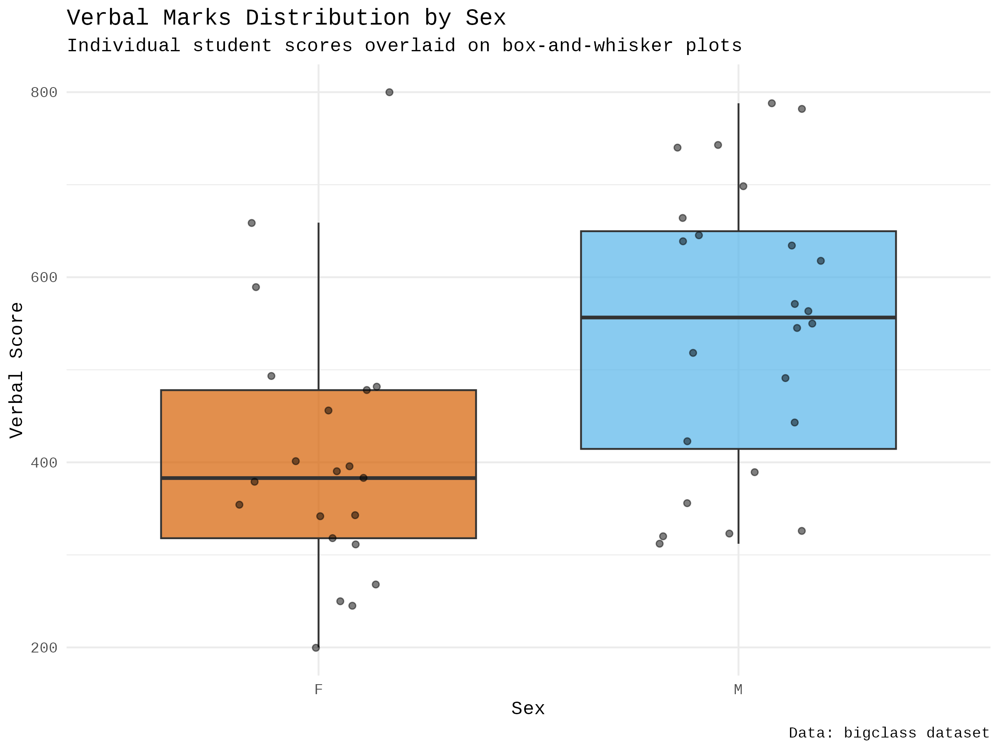

:::: {.columns}
::: {.column width="50%"}

## Sample slides
#### PlaceHolderName
#### Universiti Malaysia Perlis
#### [placeholder@email.com](mailto:placeholder@email.com)

<audio id="bg-music" src="media/audio/sb.m4a" loop></audio>

  Music: “Adrift” by Scott Buckley (CC BY 4.0)

:::

::: {.column width="50%"}

:::

::::

---

:::: {.columns}
::: {.column width="50%"}
### Slide one
**Key Concepts:**
- Energy conservation per @carnot1824.
- $\Delta U = Q - W$
:::

::: {.column width="50%"}

:::
::::

---

---

:::: {.columns}
::: {.column width="50%"}
### The Master Equation
The fundamental relation of thermodynamics:

$$\Delta U = Q - W$$

The work done $W$ is positive when the system expands against an external pressure.
:::

::: {.column width="50%"}
<video data-src="media/videos/sample.mp4" data-autoplay loop muted width="100%"></video>
:::

::::

---

:::: {.columns}
::: {.column width="50%"}
### Visualizing the Gas Law
**Interactive Model:**

- P, V, and T relationships.
- Use the slider to adjust pressure.
- Observe the phase boundary.
:::

::: {.column width="50%"}
<iframe 
  data-src="media/plots/sample.html" 
  width="100%" 
  height="500px" 
  style="border:none;" 
  scrolling="no">
</iframe>
:::
::::

---

:::: {.columns}
::: {.column width="50%"}
### Math Scores Distribution

This histogram visualizes the distribution of Math scores within our dataset. We can observe the frequency of different score ranges.

**Observations:**
- The scores appear to be spread across a range, with a concentration around certain values.
:::

::: {.column width="50%"}
<iframe 
  data-src='media/plots/math_scores_histogram.html' 
  width='100%' 
  height='500px' 
  style='border:none;' 
  scrolling='no'>
</iframe>
:::

::::

---

:::: {.columns}
::: {.column width="50%"}
### Verbal Scores Distribution

This histogram illustrates the distribution of Verbal scores, providing insights into the spread and common ranges of performance in this subject.

**Observations:**
- Similar to Math scores, Verbal scores show varying frequencies across different bins.
:::

::: {.column width="50%"}
<iframe 
  data-src='media/plots/verbal_scores_histogram.html' 
  width='100%' 
  height='500px' 
  style='border:none;' 
  scrolling='no'>
</iframe>
:::

::::

---

:::: {.columns}
::: {.column width="50%"}
### Math Scores Distribution

This histogram visualizes the distribution of Math scores within our dataset. We can observe the frequency of different score ranges.

**Observations:**
- The scores appear to be spread across a range, with a concentration around certain values.
:::

::: {.column width="50%"}
<iframe 
  data-src='media/plots/math_scores_histogram.html' 
  width='100%' 
  height='500px' 
  style='border:none;' 
  scrolling='no'>
</iframe>
:::

::::

---

:::: {.columns}
::: {.column width="50%"}
### Verbal Scores Distribution

This histogram illustrates the distribution of Verbal scores, providing insights into the spread and common ranges of performance in this subject.

**Observations:**
- Similar to Math scores, Verbal scores show varying frequencies across different bins.
:::

::: {.column width="50%"}
<iframe 
  data-src='media/plots/verbal_scores_histogram.html' 
  width='100%' 
  height='500px' 
  style='border:none;' 
  scrolling='no'>
</iframe>
:::

::::

---

:::: {.columns}
::: {.column width="50%"}
### Math Scores: Boxplot by Sex

This boxplot illustrates the distribution of Math scores, allowing for a comparison of performance between different sexes. It helps in identifying potential differences in score ranges and medians.
:::

::: {.column width="50%"}
<iframe
  data-src='media/plots/math_scores_boxplot_by_sex.html'
  width='100%'
  height='500px'
  style='border:none;'
  scrolling='no'>
</iframe>
:::

::::

---

:::: {.columns}
::: {.column width="50%"}
### Math Scores: Average by Sex Bar Chart

This bar chart presents the average Math scores for each sex, providing a clear visual comparison of typical performance levels.
:::

::: {.column width="50%"}
<iframe
  data-src='media/plots/math_scores_barchart_avg_by_sex.html'
  width='100%'
  height='500px'
  style='border:none;'
  scrolling='no'>
</iframe>
:::

::::

---

:::: {.columns}
::: {.column width="50%"}
### Math Scores: Scatterplot vs. Age

This scatterplot shows the relationship between Math scores and age, with different sexes distinguished by color. This helps to visualize any trends or correlations between age, sex, and Math performance.
:::

::: {.column width="50%"}
<iframe
  data-src='media/plots/math_scores_scatterplot_age.html'
  width='100%'
  height='500px'
  style='border:none;'
  scrolling='no'>
</iframe>
:::

::::

---

:::: {.columns}
::: {.column width="50%"}
### Verbal Scores: Boxplot by Sex

This boxplot illustrates the distribution of Verbal scores, allowing for a comparison of performance between different sexes. It helps in identifying potential differences in score ranges and medians.
:::

::: {.column width="50%"}
<iframe
  data-src='media/plots/verbal_scores_boxplot_by_sex.html'
  width='100%'
  height='500px'
  style='border:none;'
  scrolling='no'>
</iframe>
:::

::::

---

:::: {.columns}
::: {.column width="50%"}
### Verbal Scores: Average by Sex Bar Chart

This bar chart presents the average Verbal scores for each sex, providing a clear visual comparison of typical performance levels.
:::

::: {.column width="50%"}
<iframe
  data-src='media/plots/verbal_scores_barchart_avg_by_sex.html'
  width='100%'
  height='500px'
  style='border:none;'
  scrolling='no'>
</iframe>
:::

::::

---

:::: {.columns}
::: {.column width="50%"}
### Verbal Scores: Scatterplot vs. Age

This scatterplot shows the relationship between Verbal scores and age, with different sexes distinguished by color. This helps to visualize any trends or correlations between age, sex, and Verbal performance.
:::

::: {.column width="50%"}
<iframe
  data-src='media/plots/verbal_scores_scatterplot_age.html'
  width='100%'
  height='500px'
  style='border:none;'
  scrolling='no'>
</iframe>
:::

::::

---

:::: {.columns}
::: {.column width="50%"}
### Age Distribution Histogram

This histogram displays the distribution of ages within the dataset, allowing us to see the frequency of different age groups.
:::

::: {.column width="50%"}
<iframe
  data-src='media/plots/age_distribution_histogram.html'
  width='100%'
  height='500px'
  style='border:none;'
  scrolling='no'>
</iframe>
:::

::::

---

:::: {.columns}
::: {.column width="50%"}
### Math Scores Distribution

This histogram visualizes the distribution of Math scores within our dataset. We can observe the frequency of different score ranges.

**Observations:**
- The scores appear to be spread across a range, with a concentration around certain values.
:::

::: {.column width="50%"}
<iframe 
  data-src='media/plots/math_scores_histogram.html' 
  width='100%' 
  height='500px' 
  style='border:none;' 
  scrolling='no'>
</iframe>
:::

::::

---

:::: {.columns}
::: {.column width="50%"}
### Verbal Scores Distribution

This histogram illustrates the distribution of Verbal scores, providing insights into the spread and common ranges of performance in this subject.

**Observations:**
- Similar to Math scores, Verbal scores show varying frequencies across different bins.
:::

::: {.column width="50%"}
<iframe 
  data-src='media/plots/verbal_scores_histogram.html' 
  width='100%' 
  height='500px' 
  style='border:none;' 
  scrolling='no'>
</iframe>
:::

::::

---

:::: {.columns}
::: {.column width="50%"}
### Math Scores: Overview of Distributions and Relationships

This slide presents a comprehensive overview of the Math scores in the dataset, visualized through a combination of a histogram, boxplot by sex, bar chart of average scores by sex, and a scatterplot against age. This multi-panel view allows for a quick understanding of the score distribution, gender-based differences, and age-related trends.
:::

::: {.column width="50%"}
<iframe 
  data-src='media/plots/math_scores_overview.html' 
  width='100%' 
  height='500px' 
  style='border:none;' 
  scrolling='no'>
</iframe>
:::

::::

---

:::: {.columns}
::: {.column width="50%"}
### Verbal Scores: Overview of Distributions and Relationships

This slide provides a similar multi-panel analysis for Verbal scores, including its distribution, gender-based comparison, average scores by sex, and its relationship with age. This offers a parallel perspective to the Math scores analysis.
:::

::: {.column width="50%"}
<iframe 
  data-src='media/plots/verbal_scores_overview.html' 
  width='100%' 
  height='500px' 
  style='border:none;' 
  scrolling='no'>
</iframe>
:::

::::

---

:::: {.columns}
::: {.column width="50%"}
### Math Scores: Boxplot by Sex

This boxplot illustrates the distribution of Math scores, allowing for a comparison of performance between different sexes. It helps in identifying potential differences in score ranges and medians.
:::

::: {.column width="50%"}
<iframe
  data-src='media/plots/math_scores_boxplot_by_sex.html'
  width='100%'
  height='500px'
  style='border:none;'
  scrolling='no'>
</iframe>
:::

::::

---

:::: {.columns}
::: {.column width="50%"}
### Math Scores: Average by Sex Bar Chart

This bar chart presents the average Math scores for each sex, providing a clear visual comparison of typical performance levels.
:::

::: {.column width="50%"}
<iframe
  data-src='media/plots/math_scores_barchart_avg_by_sex.html'
  width='100%'
  height='500px'
  style='border:none;'
  scrolling='no'>
</iframe>
:::

::::

---

:::: {.columns}
::: {.column width="50%"}
### Math Scores: Scatterplot vs. Age

This scatterplot shows the relationship between Math scores and age, with different sexes distinguished by color. This helps to visualize any trends or correlations between age, sex, and Math performance.
:::

::: {.column width="50%"}
<iframe
  data-src='media/plots/math_scores_scatterplot_age.html'
  width='100%'
  height='500px'
  style='border:none;'
  scrolling='no'>
</iframe>
:::

::::

---

:::: {.columns}
::: {.column width="50%"}
### Verbal Scores: Boxplot by Sex

This boxplot illustrates the distribution of Verbal scores, allowing for a comparison of performance between different sexes. It helps in identifying potential differences in score ranges and medians.
:::

::: {.column width="50%"}
<iframe
  data-src='media/plots/verbal_scores_boxplot_by_sex.html'
  width='100%'
  height='500px'
  style='border:none;'
  scrolling='no'>
</iframe>
:::

::::

---

:::: {.columns}
::: {.column width="50%"}
### Verbal Scores: Average by Sex Bar Chart

This bar chart presents the average Verbal scores for each sex, providing a clear visual comparison of typical performance levels.
:::

::: {.column width="50%"}
<iframe
  data-src='media/plots/verbal_scores_barchart_avg_by_sex.html'
  width='100%'
  height='500px'
  style='border:none;'
  scrolling='no'>
</iframe>
:::

::::

---

:::: {.columns}
::: {.column width="50%"}
### Verbal Scores: Scatterplot vs. Age

This scatterplot shows the relationship between Verbal scores and age, with different sexes distinguished by color. This helps to visualize any trends or correlations between age, sex, and Verbal performance.
:::

::: {.column width="50%"}
<iframe
  data-src='media/plots/verbal_scores_scatterplot_age.html'
  width='100%'
  height='500px'
  style='border:none;'
  scrolling='no'>
</iframe>
:::

::::

---

:::: {.columns}
::: {.column width="50%"}
### Age Distribution Histogram

This histogram displays the distribution of ages within the dataset, allowing us to see the frequency of different age groups.
:::

::: {.column width="50%"}
<iframe
  data-src='media/plots/age_distribution_histogram.html'
  width='100%'
  height='500px'
  style='border:none;'
  scrolling='no'>
</iframe>
:::

::::

---

:::: {.columns}
::: {.column width="50%"}
### Average Math Score by Sex

This bar chart illustrates the average Math scores, allowing for a clear comparison of typical performance levels between different sexes.
:::

::: {.column width="50%"}
<iframe
  data-src='media/plots/math_scores_barchart_avg_by_sex.html'
  width='100%'
  height='500px'
  style='border:none;'
  scrolling='no'>
</iframe>
:::

::::

---

:::: {.columns}
::: {.column width="50%"}
### Weight Distribution by Sex

This boxplot visualizes the distribution of weight, allowing for a comparison of weight ranges and medians between different sexes.
:::

::: {.column width="50%"}
<iframe
  data-src='media/plots/weight_distribution_boxplot_by_sex.html'
  width='100%'
  height='500px'
  style='border:none;'
  scrolling='no'>
</iframe>
:::

::::

---

:::: {.columns}
::: {.column width="50%"}
### Height vs. Weight Scatterplot by Sex

This scatterplot visualizes the relationship between height and weight, with points colored by sex to highlight any gender-specific patterns or differences in this correlation.
:::

::: {.column width="50%"}
<iframe
  data-src='media/plots/height_weight_scatterplot_by_sex.html'
  width='100%'
  height='500px'
  style='border:none;'
  scrolling='no'>
</iframe>
:::

::::

---
# Bibliography

